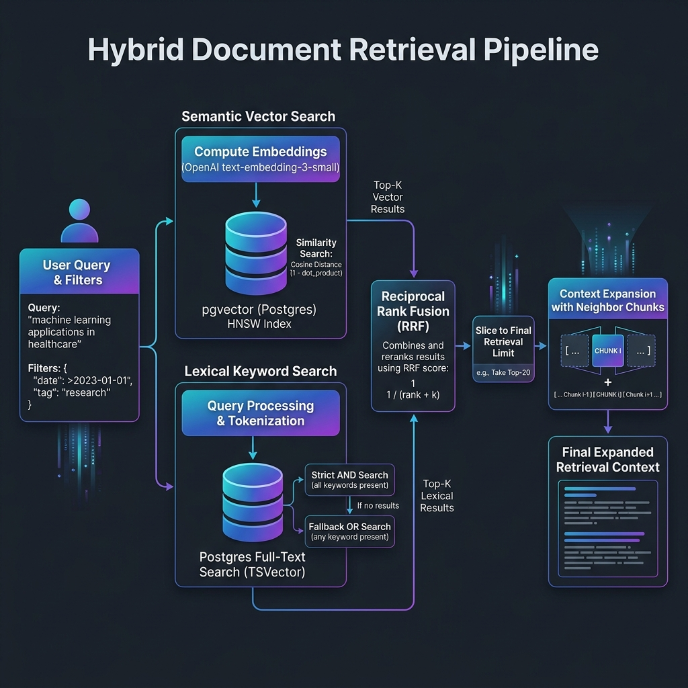

# Hybrid Retrieval Pipeline

This directory contains the core implementation of the hybrid document retrieval system. The pipeline integrates semantic vector similarity search and keyword-based lexical search to retrieve highly relevant passages from corporate filings (10-K/10-Q), merging the results using Reciprocal Rank Fusion (RRF).

---

## How the Pipeline Works

The pipeline executes a search in the following sequential stages:



### System Flowchart (Mermaid)
```mermaid
graph TD
    Input[User Query + Optional Filters] --> Embed[1. Generate Query Embedding]
    Embed --> SemSearch[2. Vector Similarity Search]
    Input --> LexSearch[3. Lexical FTS Search]
    
    subgraph Semantic Search (pgvector)
        SemSearch --> VecQuery[Query document_chunks ordered by cosine_distance]
    end
    
    subgraph Lexical Search (Postgres FTS)
        LexSearch --> StrictFTS[Strict FTS websearch_to_tsquery - AND]
        StrictFTS --> EmptyCheck{Results found?}
        EmptyCheck -- Yes --> LexResult[Top candidate chunks]
        EmptyCheck -- No --> FallbackFTS[Fallback FTS to_tsquery - OR]
        FallbackFTS --> LexResult
    end
    
    VecQuery --> Fusion[4. Reciprocal Rank Fusion RRF]
    LexResult --> Fusion
    
    subgraph Rank Fusion & Filtering
        Fusion --> Dedup[Deduplicate and calculate RRF scores]
        Dedup --> Rank[Sort descending by RRF score]
        Rank --> Limit[Slice to retrieval_limit]
    end
    
    Limit --> Output[list of SourcePassage]
    Output --> OptionalNeighbors[5. Optional context expansion via get_chunk_with_neighbors]
```

### 1. Semantic Vector Search
- Generates a 1536-dimension query embedding using OpenAI's `text-embedding-3-small`.
- Computes cosine distance against chunk vectors using pgvector.
- Pulls up to `retrieval_candidate_k` candidate chunks.

### 2. Lexical Keyword Search
- Utilizes Postgres Full-Text Search (FTS) with english configuration.
- **Strict Mode (AND)**: Performs a websearch query (`websearch_to_tsquery`) requiring all words to match.
- **Fallback Mode (OR)**: If the strict query yields zero results, it automatically splits the query words and joins them with `|` (OR logical operator) using `to_tsquery`. This ensures keyword search coverage even for verbose query strings.
- Pulls up to `retrieval_candidate_k` candidate chunks ranked by `ts_rank_cd`.

### 3. Reciprocal Rank Fusion (RRF)
- Merges the semantic and lexical lists into a single ranked list.
- Scoring formula for a document $d$:
  $$RRF\_Score(d) = \sum_{m \in M} \frac{1}{rrf\_k + rank_m(d)}$$
  where $M$ is the set of search methods (vector, lexical) and $rank_m(d)$ is the 1-based rank of the document in search method $m$.
- Deduplicates chunks, sorts by score, and slices to the final `retrieval_limit`.

---

## Default Configuration Settings

Configuration values are defined in `app/config.py` with the following default parameters:

| Parameter Name | Type | Default Value | Description |
| :--- | :--- | :--- | :--- |
| `openai_embedding_model` | `str` | `"text-embedding-3-small"` | OpenAI model used to embed queries. |
| `openai_embedding_dimensions` | `int` | `1536` | Output dimensions of the generated embeddings. |
| `retrieval_limit` | `int` | `10` | The maximum number of passages returned after RRF fusion. |
| `retrieval_candidate_k` | `int` | `50` | Number of candidate chunks retrieved from each retrieval branch. |
| `rrf_k` | `int` | `60` | Constant used in the RRF denominator to scale ranks. |

---

## Module Reference

- [types.py](file:///c:/Users/karan/OneDrive/Documents/AiChatbot/document-copilot/backend/app/retrieval/types.py): Core schema definitions for filters (`RetrievalFilter`, `SearchFilters`) and returned structures (`SourcePassage`).
- [embeddings.py](file:///c:/Users/karan/OneDrive/Documents/AiChatbot/document-copilot/backend/app/retrieval/embeddings.py): Wrapper communicating with OpenAI embeddings endpoint.
- [queries.py](file:///c:/Users/karan/OneDrive/Documents/AiChatbot/document-copilot/backend/app/retrieval/queries.py): Database query execution scripts for vector similarity search and Postgres full-text search.
- [fusion.py](file:///c:/Users/karan/OneDrive/Documents/AiChatbot/document-copilot/backend/app/retrieval/fusion.py): Reciprocal Rank Fusion algorithm.
- [retriever.py](file:///c:/Users/karan/OneDrive/Documents/AiChatbot/document-copilot/backend/app/retrieval/retriever.py): Orchestrates query embeddings, parallel search execution, RRF sorting, and schema mapping.
