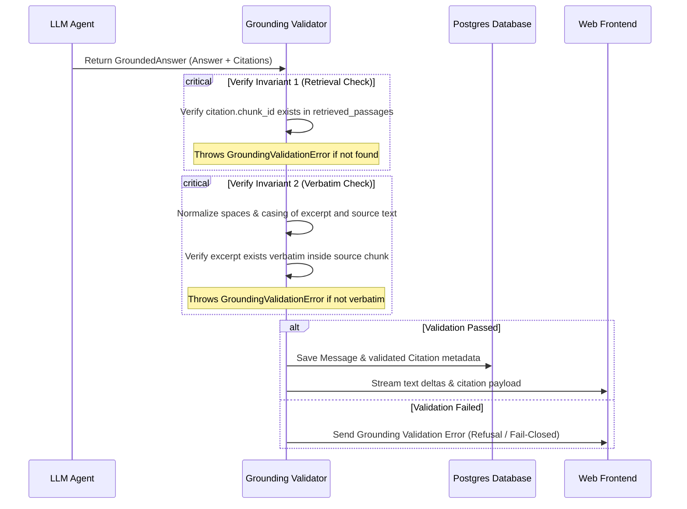

# Retrieval and Grounding Validation Pipeline

This document provides a comprehensive technical overview of the search (retrieval) architecture and the subsequent citation verification (grounding) process. Together, these systems implement a trust-focused pipeline designed to eliminate hallucinations, enforce source grounding, and allow corporate analysts to easily verify any generated answer.

---

## 1. Retrieval Pipeline Architecture

The retrieval pipeline uses a hybrid search strategy that combines semantic (dense vector) similarity search and lexical (keyword/sparse) full-text search. The candidate passages retrieved from both branches are merged and ranked using **Reciprocal Rank Fusion (RRF)**.

### Search and Rank Fusion Flow


#### System Flowchart (Mermaid)
```mermaid
graph TD
    Input["User Query + Optional Filters (Ticker/Year)"] --> Embed["1. Generate Query Embedding"]
    Embed --> SemSearch["2. Vector Similarity Search"]
    Input --> LexSearch["3. Lexical FTS Search"]
    
    subgraph Semantic Search (pgvector)
        SemSearch --> VecQuery["Query document_chunks ordered by cosine_distance"]
    end
    
    subgraph Lexical Search (Postgres FTS)
        LexSearch --> StrictFTS["Strict FTS websearch_to_tsquery - AND"]
        StrictFTS --> EmptyCheck{"Results found?"}
        EmptyCheck -- Yes --> LexResult["Top candidate chunks"]
        EmptyCheck -- No --> FallbackFTS["Fallback FTS to_tsquery - OR"]
        FallbackFTS --> LexResult
    end
    
    VecQuery --> Fusion["4. Reciprocal Rank Fusion RRF"]
    LexResult --> Fusion
    
    subgraph Rank Fusion & Filtering
        Fusion --> Dedup["Deduplicate and calculate RRF scores"]
        Dedup --> Rank["Sort descending by RRF score"]
        Rank --> Limit["Slice to retrieval_limit"]
    end
    
    Limit --> Output["list of SourcePassage"]
    Output --> OptionalNeighbors["5. Context expansion (read_passage_context)"]
```

### Key Retrieval Components

1. **Semantic Vector Search**:
   - Generates a `1536`-dimension embedding of the user's query using OpenAI's `text-embedding-3-small` model.
   - Executes a cosine distance query using `pgvector` to identify chunks whose semantic representation is closest to the query.
   - Filters the candidate set by ticker and fiscal year if specified.
   - Returns up to `retrieval_candidate_k` (default: 50) candidate chunks.
   - *Code Entrypoint*: [vector_search](file:///c:/Users/karan/OneDrive/Documents/AiChatbot/document-copilot/backend/app/retrieval/queries.py)

2. **Lexical Full-Text Search**:
   - Utilizes Postgres Full-Text Search (`FTS`) configured with `english` dictionary parsing on the precomputed `search_vector` column of the `document_chunks` table.
   - **Strict Mode (AND)**: Attempts to match *all* terms in the query string using `websearch_to_tsquery`.
   - **Fallback Mode (OR)**: If Strict Mode returns zero results, it splits the query words and joins them using the logical OR operator (`|`) via `to_tsquery`. This guarantees keyword match fallback for long or verbose queries.
   - Returns up to `retrieval_candidate_k` candidates ranked by `ts_rank_cd`.
   - *Code Entrypoint*: [lexical_search](file:///c:/Users/karan/OneDrive/Documents/AiChatbot/document-copilot/backend/app/retrieval/queries.py)

3. **Reciprocal Rank Fusion (RRF)**:
   - Fuses the semantic and lexical results into a single ranked list.
   - The RRF score for a chunk $d$ is calculated as:
     $$RRF(d) = \sum_{m \in M} \frac{1}{k + rank_m(d)}$$
     Where $M$ is the set of retrieval methods (vector, lexical), $rank_m(d)$ is the 1-based rank of chunk $d$ in method $m$, and $k$ is a constant smoothing parameter (default: `60`).
   - Sorts chunks descending by their RRF score and limits the output to `retrieval_limit` (default: `10`).
   - *Code Entrypoint*: [reciprocal_rank_fusion](file:///c:/Users/karan/OneDrive/Documents/AiChatbot/document-copilot/backend/app/retrieval/fusion.py)

4. **Context Expansion**:
   - The agent can optionally inspect adjacent chunks (e.g., surrounding text of the target chunk) using the `read_passage_context` tool. This retrieves the previous and next chunks (`before=1`, `after=1`) sorted by `chunk_index` to handle splits that cut off key financial sentences.
   - *Code Entrypoint*: [read_passage_context](file:///c:/Users/karan/OneDrive/Documents/AiChatbot/document-copilot/backend/app/assistant/agent.py)

---

## 2. Grounding Validation Engine

The grounding engine acts as a safety gate between LLM generation and client consumption. Every citation returned by the agent is strictly verified against what was actually retrieved from the database and what exists in the source filings.



### The Grounding Invariants

The [validate_grounding](file:///c:/Users/karan/OneDrive/Documents/AiChatbot/document-copilot/backend/app/grounding/validator.py) function enforces two major invariants:

1. **Retrieval Verification (Invariant 1)**:
   - **Rule**: Every cited chunk ID must belong to the set of retrieved passages (`deps.retrieved_passages`).
   - **Reasoning**: This prevents the LLM from inventing fake chunk IDs or referencing source documents that were never loaded into the context during the current run.
   - **Implementation**:
     ```python
     if chunk_key not in retrieved_passages:
         raise GroundingValidationError(
             f"Citation index {citation.citation_index} cites chunk ID {citation.chunk_id} "
             "which was not retrieved or read during this request."
         )
     ```

2. **Verbatim Text Alignment (Invariant 2)**:
   - **Rule**: The citation excerpt must exist *exactly* inside the source text of the matching chunk.
   - **Reasoning**: This prevents semantic drift and partial hallucinations where the LLM attributes claims to a passage that the passage does not support.
   - **Implementation**: The validator normalizes whitespace and casing on both the excerpt and the source text before executing a substring match:
     ```python
     def _normalize_text(text: str) -> str:
         return re.sub(r'\s+', ' ', text).strip().lower()

     norm_excerpt = _normalize_text(citation.excerpt)
     norm_chunk_text = _normalize_text(passage.text)
     
     if norm_excerpt not in norm_chunk_text:
         raise GroundingValidationError(
             f"Citation index {citation.citation_index} cites excerpt '{citation.excerpt}' "
             f"which does not exist verbatim inside the text of chunk {citation.chunk_id}."
         )
     ```

### Refusal Exemption

When the retrieval pipeline has insufficient data to answer a query, the agent is configured to return:
> *"I cannot answer this question because the loaded filings do not contain sufficient evidence."*

If the answer matches this exact refusal string, the grounding validator bypasses the citation check and returns an empty citations array. This allows the system to refuse safely without failing validation.

---

## 3. Database Persistence and Schema

Once validated, citations are persisted in the database to allow the frontend to display detailed metadata (e.g. company, filing type, fiscal year, section, and page number) when the user hovers over or clicks a citation chip.

- **`chat_messages`**: Stores the structured message body, including the assistant's answer text and the citation JSON block in the payload.
- **`message_citations`**: Holds individual records referencing `document_chunks` (via `chunk_id`) and the parent `message_id`, containing:
  - `citation_index`: The 1-based index (e.g., `1`, `2`, `3`) shown in the response.
  - `citation_metadata`: A JSONB column containing the source metadata snapshot (company, filing, year, section, page, excerpt).

*Code Reference*: [orchestrate_chat_turn](file:///c:/Users/karan/OneDrive/Documents/AiChatbot/document-copilot/backend/app/chat/orchestrator.py) handles saving messages and mapping citations.
